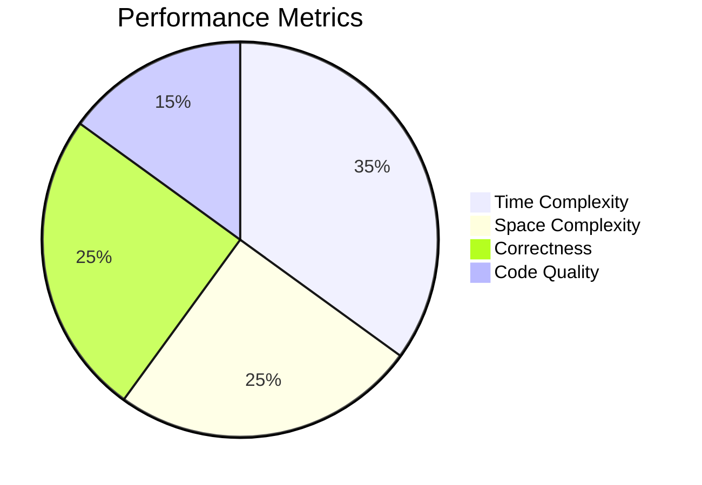

# 🧠 Data Structures & Algorithms Interactive Labs

<div align="center">
  
</div>

---

## 🌟 Key Features

### 🚀 Interactive Learning Experience

- **Live Code Editor** with syntax highlighting and auto-completion  
- **Visualization Tools** for algorithms (sorting, graph traversals, etc.)  
- **Step-by-Step Debugger** to understand algorithm execution  
- **Real-time Output** visualization  
- **Quantum-inspired UI** with animated components  
- **Admin Panel** for challenge management  

---

### 📚 Comprehensive DSA Coverage

| Category              | Topics Included                                                                 |
|-----------------------|---------------------------------------------------------------------------------|
| **Fundamentals**      | Big-O Analysis, Recursion, Problem-Solving Patterns                            |
| **Data Structures**   | Arrays, Linked Lists, Stacks, Queues, Hash Tables, Trees, Graphs, Heaps        |
| **Algorithms**        | Sorting, Searching, Dynamic Programming, Greedy Algorithms, Backtracking       |
| **Advanced Topics**   | Trie, Segment Trees, Disjoint Set Union, Suffix Arrays                         |

---

## 💻 Tech Stack

### Frontend  
  
  


### Visualization  
  


### Backend  
  
  


---

## 🏗️ Project Structure

<details>
<summary>Click to expand</summary>

```plaintext
dsa-labs/
├── client/               # Frontend React application
│   ├── public/           # Static assets (images, icons, favicon, etc.)
│   └── src/              # Core source code
│       ├── components/   # Reusable UI components
│       ├── sections/     # Section-based layout pages
│       ├── utils/        # Helper and utility functions
│       └── App.js        # Main entry React component
├── server/               # Backend Express API
│   ├── models/           # MongoDB models (Schemas)
│   ├── routes/           # API endpoints for challenges, users, etc.
│   └── app.js            # Main Express server file
└── README.md             # Project documentation
## 🛠️ Installation & Setup
```
</details>

### 📋 Prerequisites

- **Node.js** (v16+)
- **MongoDB Atlas** account or local MongoDB instance
- **Git**

---

### 🔧 1. Clone the Repository

```bash
git clone https://github.com/your-username/dsa-interactive-labs.git
cd dsa-interactive-labs
```
### 🔐 2. Set Up Environment Variables

Create the following `.env` files:

#### `client/.env`

```env
REACT_APP_API_URL=http://localhost:5000
VITE_ADMIN_PIN=****  # For admin panel access
```
### 🔐 `server/.env`

```env
PORT=5000
MONGODB_URI=mongodb+srv://<username>:<password>@cluster0.mongodb.net/dsa-labs?retryWrites=true&w=majority
JWT_SECRET=your_jwt_secret_here
```
### 📦 3. Install Dependencies & Run

```bash
# Install dependencies for both client and server
npm run setup

# Start development servers (runs both concurrently)
npm run dev
```
# 🎮 Using the Interactive Labs

## Lab Features
- ✨ **Holographic UI** with animated components  
- 🧩 **Code Challenges** with multiple difficulty levels  
- 🐞 **Visual Debugger** with step-through execution  
- 📊 **Performance Metrics** comparison  
- 🔐 **Admin Panel** (access with PIN) to manage challenges  

---

## 🧪 Challenge Workflow
1. **Select a topic** (e.g., _"Binary Search Trees"_)
2. **Read** problem statement and examples
3. **Write solution** in embedded editor (supports 10+ languages)
4. **Use visualizer** to debug your approach
5. **Submit** to see performance metrics

## 📊 Progress Tracking

### 🔐 User Authentication System
- Secure JWT-based authentication
- Role-based access control (Student/Admin)
- OAuth integration (Google, GitHub)
- Password recovery flow

### ✅ Challenge Completion Tracking
| Feature                | Description                                                                 |
|------------------------|-----------------------------------------------------------------------------|
| **Completion Badges**  | Earn badges for completing challenge categories                             |
| **Streak Counter**     | Track consecutive days of activity                                         |
| **Milestones**         | Celebrate reaching important benchmarks                                    |
| **History**            | View all attempted challenges with timestamps                              |

### 📈 Performance Analytics Dashboard

## 🧪 Testing

### Backend Tests
```bash
cd server && npm test
```
### Frontend Tests
```bash
cd client && npm test
```
### End-to-End Tests
```bash
npm run test:e2e
```
## 🤝 Contributing

### How to Contribute

1. **Fork the repository**
   
2. **Create your feature branch**
   ```bash
   git checkout -b feature/AmazingFeature
   ```
3. **Commit your changes**

```bash
git commit -m 'Add some AmazingFeature'
```
4. **Push to the branch**

```bash
git push origin feature/AmazingFeature
```

## Contribution Guidelines

- Follow existing code style
- Write clear commit messages
- Include tests for new features
- Update documentation when needed

---

## 📜 License

This project is licensed under the MIT License – see the LICENSE file for details.

---

## ✉️ Contact

**Anish Seth – anishseth0510@gmail.com**

**Project Link – https://github.com/Anish-2005/Data-Structures-and-Algorithm**

---

<div align="center">Made with ❤️ and ☕ by <strong>Anish</strong></div>

