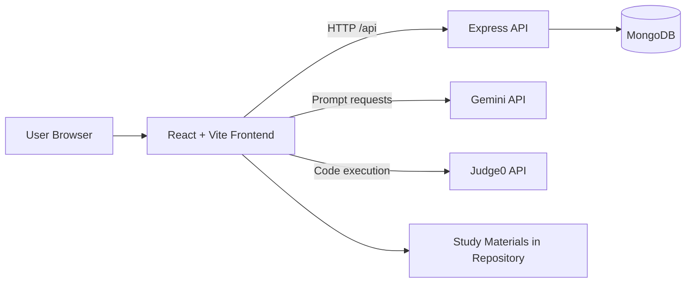

# Data Structures and Algorithms Learning Platform

<div align="center">
  

  [](dsa)
  [](dsa-backend)
  [](dsa-backend)
  [](Study%20Materials)
  [](LICENSE)
</div>

A full-stack, interactive DSA platform that combines:

- A modern React learning interface
- Interactive compiler and visualizer experiences
- A Node/Express API with MongoDB persistence
- Structured C implementations and markdown theory notes

This repository is developed for my **3rd semester Data Structures and Algorithms (DSA)** subject.

## Table of Contents

- [Platform Highlights](#platform-highlights)
- [Architecture](#architecture)
- [Repository Map](#repository-map)
- [Quick Start](#quick-start)
- [Configuration](#configuration)
- [API Overview](#api-overview)
- [Learning Coverage](#learning-coverage)
- [Development Commands](#development-commands)
- [Roadmap](#roadmap)
- [Contributing](#contributing)
- [License](#license)
- [Contact](#contact)

## Platform Highlights

| Area | What you get |
| --- | --- |
| Learning Experience | Dedicated pages for Landing, Labs, Learn, Visualizer, and Compiler |
| AI Support | Gemini-powered in-app chatbot for DSA assistance |
| Practice | Browser-based execution via Judge0 integration |
| Content Depth | 50+ data-structure and algorithm resources with C implementations |
| UX | Motion-rich interface with particles, holographic grid, and animated transitions |

## Architecture


```mermaid
flowchart LR
    U[User Browser] --> FE[React + Vite Frontend]
    FE -->|HTTP /api| BE[Express API]
    BE --> DB[(MongoDB)]
    FE -->|Prompt requests| GA[Gemini API]
    FE -->|Code execution| J0[Judge0 API]
    FE --> SM[Study Materials in Repository]
```

## Repository Map

```text
Data-Structures-and-Algorithms/
|-- dsa/                    # Frontend (React + Vite)
|-- dsa-backend/            # Backend API (Node + Express + MongoDB)
|-- Study Materials/        # C programs and markdown notes by topic
|-- CONTRIBUTING.md
|-- LICENSE
`-- README.md
```

## Quick Start

### 1. Clone

```bash
git clone https://github.com/Anish-2005/Data-Structures-and-Algorithms.git
cd Data-Structures-and-Algorithms
```

### 2. Install dependencies

```bash
cd dsa
npm install
cd ../dsa-backend
npm install
```

### 3. Configure environment

Create `dsa-backend/.env`:

```env
PORT=5000
MONGODB_URI=mongodb://localhost:27017/dsa-platform
ALLOWED_ORIGINS=http://localhost:5173,http://localhost:3000
NODE_ENV=development
```

Create `dsa/.env`:

```env
VITE_GEMINI_API_KEY=your_gemini_api_key
# Compiler page currently references REACT_APP_BACKEND in source
REACT_APP_BACKEND=http://localhost:5000
```

### 4. Run locally

Terminal 1 (backend):

```bash
cd dsa-backend
node server.js
```

Terminal 2 (frontend):

```bash
cd dsa
npm run dev
```

Open `http://localhost:5173`.

## Configuration

| Location | Variable | Purpose |
| --- | --- | --- |
| `dsa-backend/.env` | `PORT` | API server port |
| `dsa-backend/.env` | `MONGODB_URI` | MongoDB connection string |
| `dsa-backend/.env` | `ALLOWED_ORIGINS` | Comma-separated CORS origins |
| `dsa-backend/.env` | `NODE_ENV` | Environment mode |
| `dsa/.env` | `VITE_GEMINI_API_KEY` | Chatbot Gemini key |
| `dsa/.env` | `REACT_APP_BACKEND` | Base URL for compiler history API integration |

## API Overview

Base path: `/api`

| Method | Route | Description |
| --- | --- | --- |
| `GET` | `/health` | Service + DB health check |
| `GET` | `/dsa-assignments` | List assignments |
| `POST` | `/dsa-assignments` | Create assignment |
| `GET` | `/dsa-assignments/:id` | Fetch assignment by id |
| `PUT` | `/dsa-assignments/:id` | Update assignment |
| `DELETE` | `/dsa-assignments/:id` | Delete assignment |
| `POST` | `/history` | Save compiler history entry |
| `GET` | `/history?limit=10` | Read recent history |

## Learning Coverage

| Category | Topics |
| --- | --- |
| Linked Lists | Singly, Doubly, Circular, Doubly Circular |
| Stacks | Array-based stack, Linked-list stack |
| Searching | Linear Search, Binary Search |
| Sorting | Bubble, Selection, Insertion, Merge, Quick, Heap |
| Trees | BST, AVL, B-Tree, B+ Tree, Red-Black Tree, Full Binary Tree |
| Graphs | BFS, DFS |
| Academic Set | PCC-CSBS391 3rd-semester DSA assignment set |

## Development Commands

Frontend (`dsa`):

```bash
npm run dev
npm run build
npm run preview
npm run lint
```

Backend (`dsa-backend`):

```bash
node server.js
npm test
```

Note: backend `npm test` currently exits with the default placeholder script.

## Roadmap

- [ ] Add automated test coverage for frontend and backend
- [ ] Secure admin workflows and route authorization
- [ ] Improve compiler reliability and execution telemetry
- [ ] Expand algorithm visualizations with richer controls
- [ ] Add contributor-friendly issue templates and CI checks

## Contributing

Contributions are welcome. Start with the contribution guide:

- [Contributing Guide](CONTRIBUTING.md)

## License

This repository is licensed under the MIT License:

- [LICENSE](LICENSE)

## Contact

- Developer: Anish Seth
- GitHub: [@Anish-2005](https://github.com/Anish-2005)
- Email: anishseth0510@gmail.com
